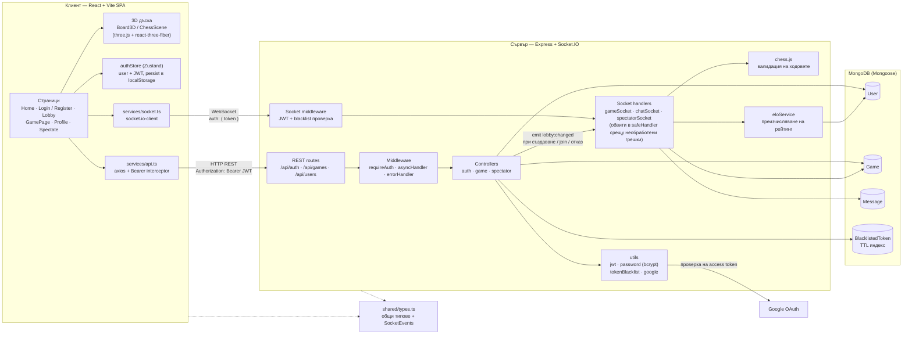
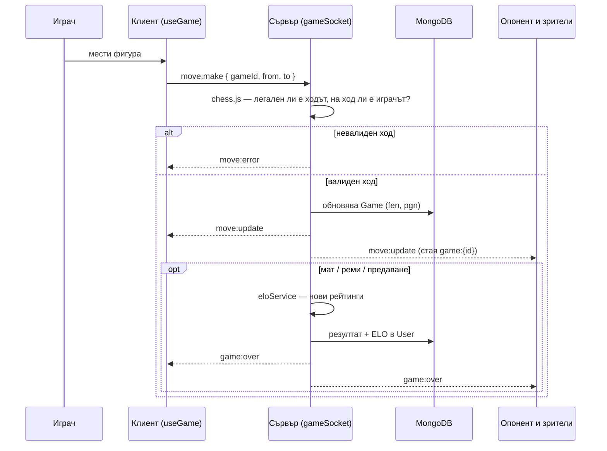
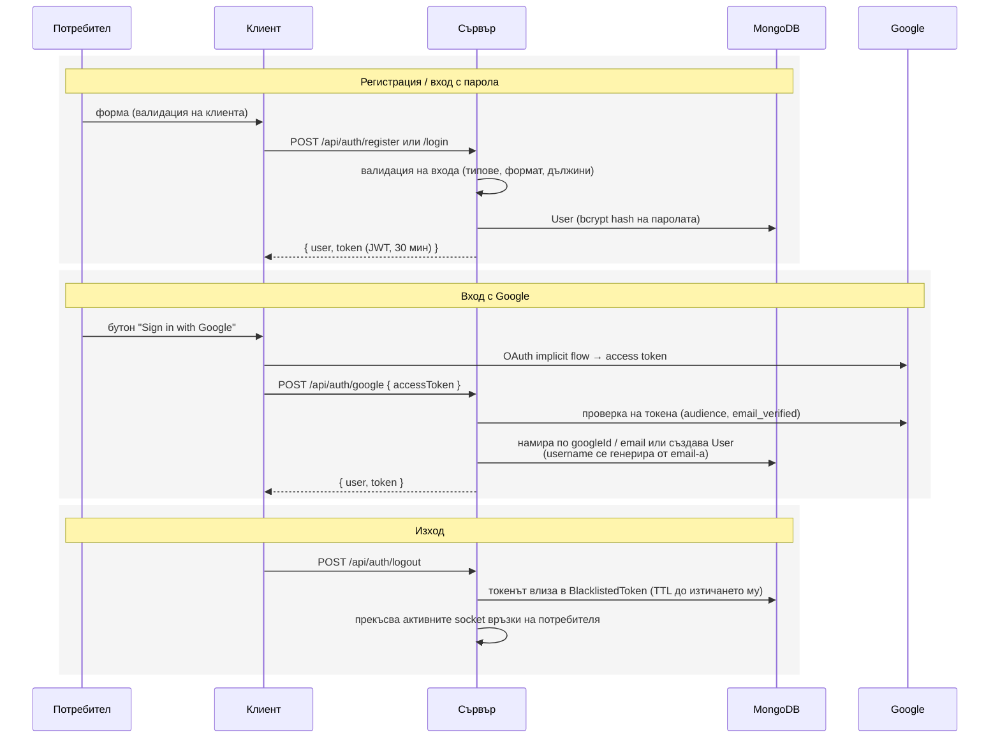

### Архитектура — Head2Head Chess

Уеб приложение за шах в реално време: React SPA клиент, Express + Socket.IO сървър и MongoDB. Клиентът и сървърът споделят общи TypeScript типове през `shared/types.ts`.

#### Обща архитектура

#### Поток на един ход

#### Автентикация

#### REST API

| Метод | Път | Auth | Описание |
|---|---|---|---|
| POST | `/api/auth/register` | – | регистрация |
| POST | `/api/auth/login` | – | вход с email/username + парола |
| POST | `/api/auth/google` | – | вход с Google access token |
| POST | `/api/auth/logout` | ✔ | изход + blacklist на токена |
| GET | `/api/auth/me` | ✔ | текущ потребител |
| POST | `/api/games` | ✔ | създаване на игра |
| GET | `/api/games/waiting` | ✔ | чакащи игри (лоби) |
| GET | `/api/games/me/current` | ✔ | моите активни игри |
| GET | `/api/games/:id` | ✔ | игра по id |
| POST | `/api/games/:id/join` | ✔ | присъединяване |
| DELETE | `/api/games/:id` | ✔ | отказ на чакаща игра |
| GET | `/api/games/spectate/:token` | – | игра по зрителски линк |
| GET | `/api/users/leaderboard` | ✔ | класация по ELO |
| GET | `/api/users/:id` | ✔ | профил |
| GET | `/api/users/:id/games` | ✔ | история на игрите |

#### Socket.IO събития

| Събитие | Посока | Описание |
|---|---|---|
| `game:join` / `game:leave` | клиент → сървър | влизане / излизане от стаята на играта |
| `move:make` | клиент → сървър | заявка за ход |
| `move:update` | сървър → стая | приет ход (нов FEN) |
| `move:error` | сървър → клиент | отхвърлен ход |
| `game:resign` | клиент → сървър | предаване |
| `game:over` | сървър → стая | край на играта + резултат |
| `draw:offer` / `draw:accept` / `draw:decline` | клиент → сървър | предложение за реми |
| `chat:send` / `chat:receive` / `chat:history` | двупосочно | чат между играчите |
| `spectator:join` / `spectator:leave` | клиент → сървър | гледане по зрителски линк |
| `lobby:changed` | сървър → всички | лобито се е променило (нова / заета / отказана игра) — клиентът презарежда списъка |

#### Модели в базата

- **User** — username, email, passwordHash (bcrypt), googleId, elo / peakElo, wins / losses / draws
- **Game** — whitePlayer / blackPlayer, статус (`waiting / active / finished`), fen, pgn (история на ходовете), result / winner / endReason, drawOffer, spectatorToken
- **Message** — чат съобщения по игра
- **BlacklistedToken** — SHA-256 хеш на анулиран JWT, изтрива се автоматично от MongoDB TTL индекс
